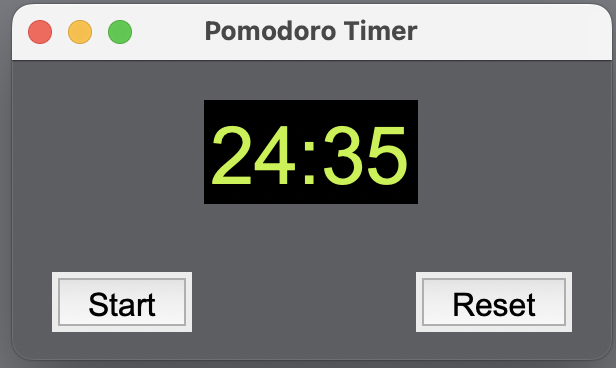

# Pomodoro Technique timer app

Implement the Pomodoro Technique with this Python timer

This app creates a GUI with a timer, a start button, and a reset button
* when the start button is clicked, the pomodoro_timer function is called to begin the 25 minute countdown
* the timer counts down, updates every second, and when it reaches 0 seconds, triggers an alarm sound
* the reset button resets the timer to 25 minutes as per the Pomodoro Technique as described in the book by Francesco Cirillo
* link to info here:  https://francescocirillo.com/products/the-pomodoro-technique
* link to how to create a timer using tkinter: https://www.tutorialspoint.com/how-to-create-a-timer-using-tkinter
* link to how to use the divmod function: https://www.programiz.com/python-programming/methods/built-in/divmod
